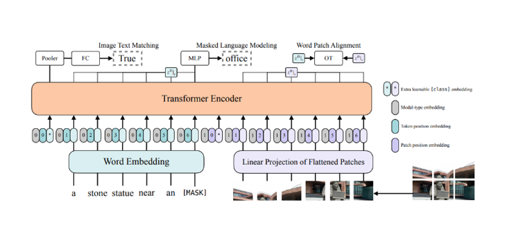

# Multi-Modal Food Classification in a Diet Tracking System
This repository contains the official implementation of [Multi-Modal Food Classification in a Diet Tracking
System with Spoken and Visual Inputs](https://ieeexplore.ieee.org/document/10095762)

## Overview
We investigated multi-modal transfer learning approaches on a novel, food-specific image-text dataset. We aim to provide new insight into the process of developing domain-specific, multi-modal deep learning models with small datasets.

## Model-I
Baseline vision-and-language model without pre-trained weights by merging CNN and LSTM models


## Model-II
Vision-and-Language Transformer (ViLT) with Pre-Trained Weights


## Citation
```BibTeX
@INPROCEEDINGS{10095762,
  author={Gowda, Shivani and Hu, Yifan and Korpusik, Mandy},
  booktitle={ICASSP 2023 - 2023 IEEE International Conference on Acoustics, Speech and Signal Processing (ICASSP)}, 
  title={Multi-Modal Food Classification in a Diet Tracking System with Spoken and Visual Inputs}, 
  year={2023},
  pages={1-5},
  doi={10.1109/ICASSP49357.2023.10095762}}
```
